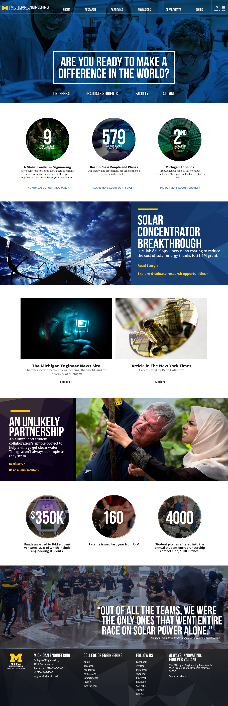
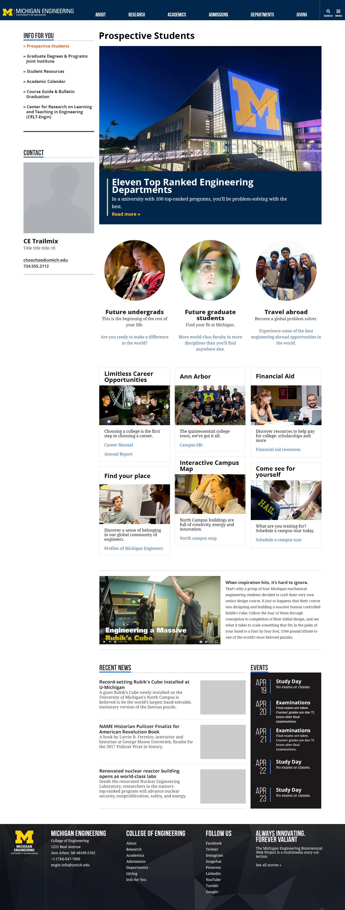

## Project duration

May 2016 - August 2017

## Role

Designer, front end, and WordPress development.

During my three-year tenure at the College of Engineering, I designed and built this and a number of other high profile sites all at the same time.

[Visit site](https://engin.umich.edu/)