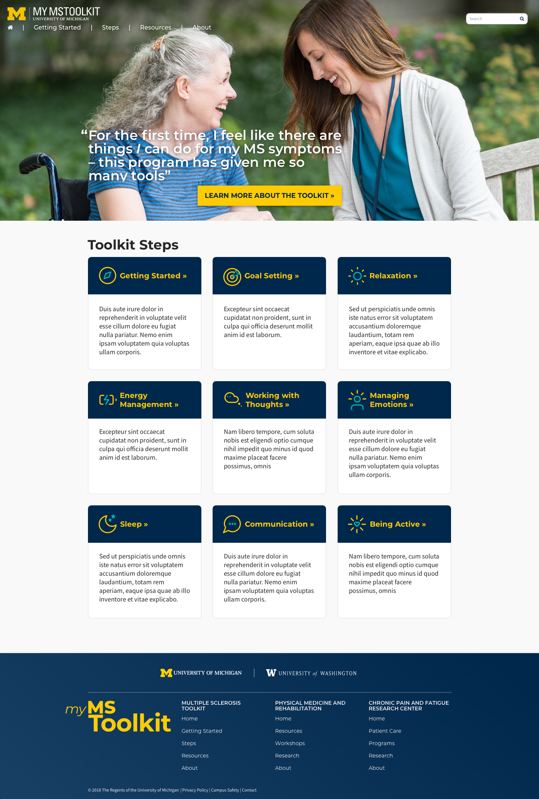
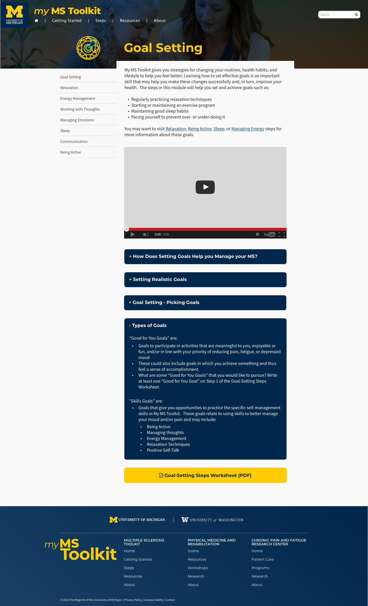

## Project duration

April 2018 - November 2018

## Role

Designer, front end, and WordPress development.

## Details

One of the most fulfilling projects our team has worked on. A rare instance where a site was tested with a focus comprised of individuals with MS. The site was a resounding success, validating our focus on outstanding accessibility. 

This was the first time I've used Lottie, a library that renders After Effects animations for the web. It was a delight creating cute, yet respectful, animations.

[Visit site](https://mymstoolkit.com/)