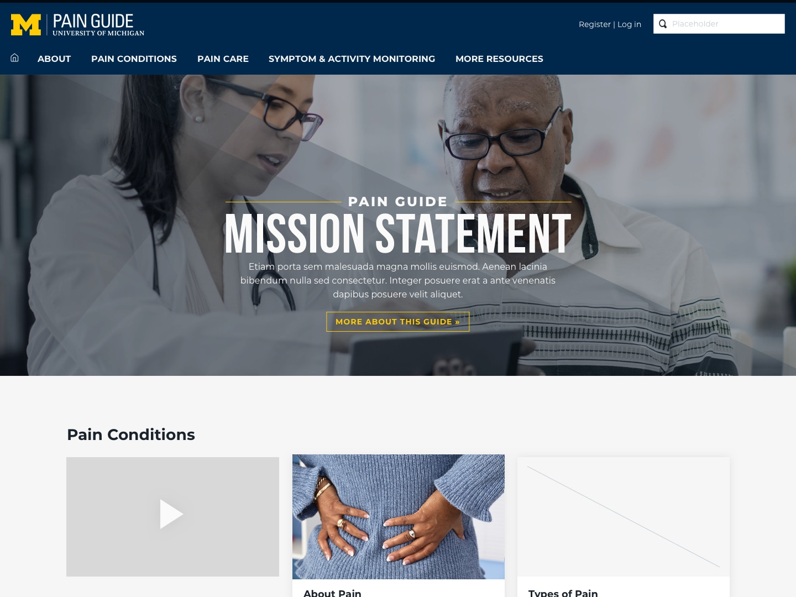
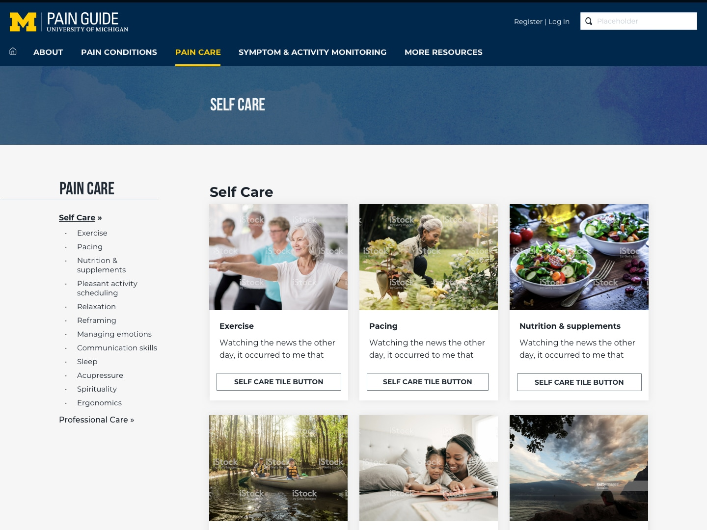

## Project duration

February 2019 - October 2020

## Role

Designer and developer (not the symptom and activity monitoring app)

## Background

A project similar to myMSToolkit. We were approached by the principle investigators to create a more robust site and a tracking app. I used [Hugo](https://gohugo.io/) and Netlify CMS for the first times and had a blast learning. It was also the first time (and last) that I used [Tachyons](https://tachyons.io/).

[Visit site](https://painguide.com/)
