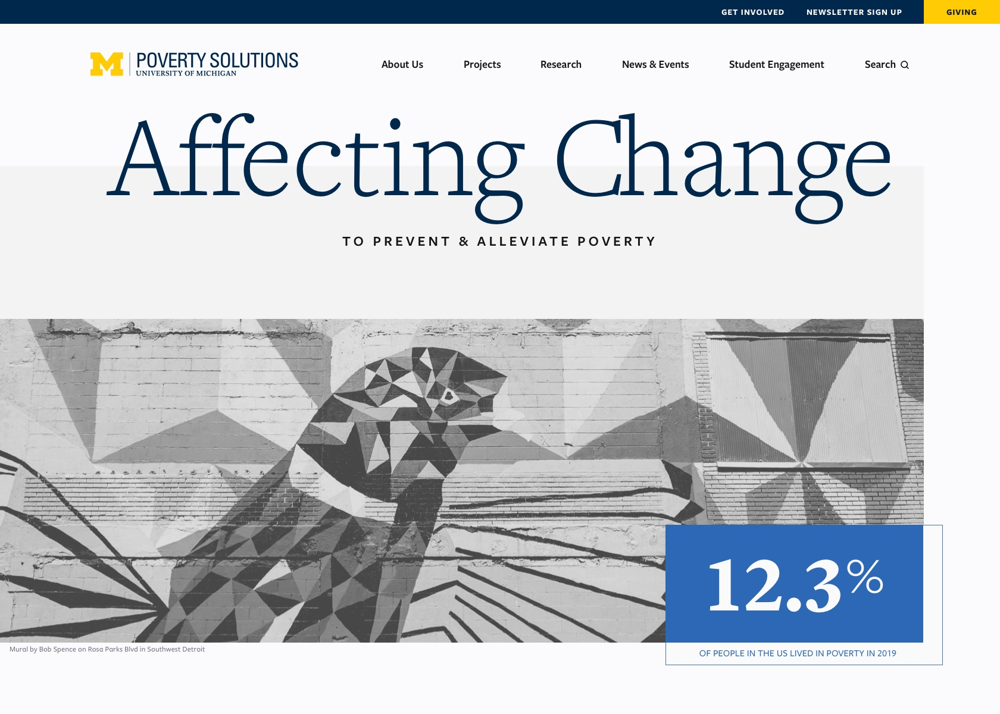
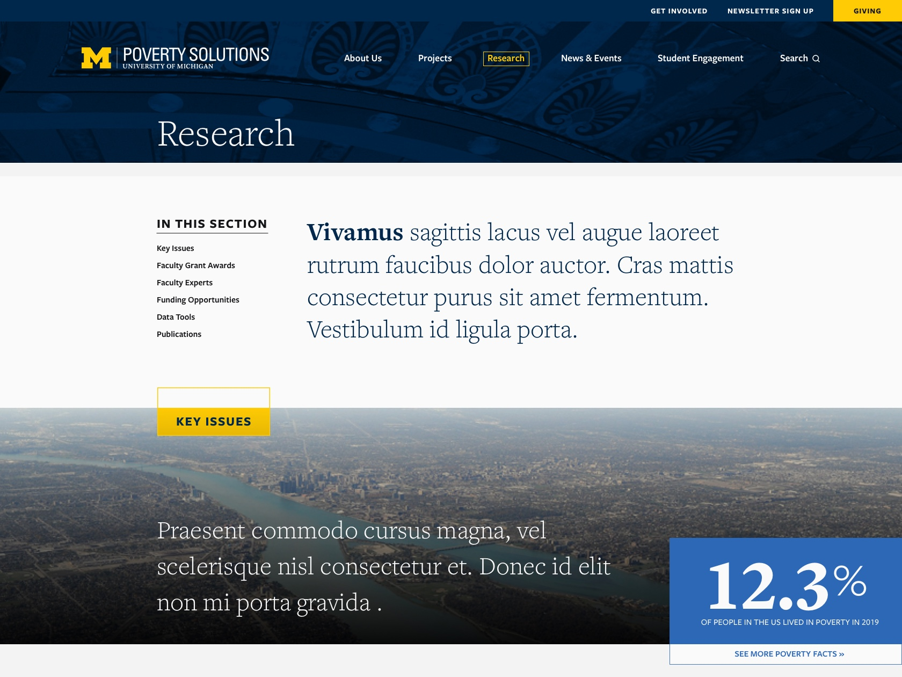

## Project duration

June 2020 - December 2020

## Role

Designer.

## Background
My final design project at Michigan Creative. The client wanted a more modern platform for their data and research. 

[Visit site](https://poverty.umich.edu/)
