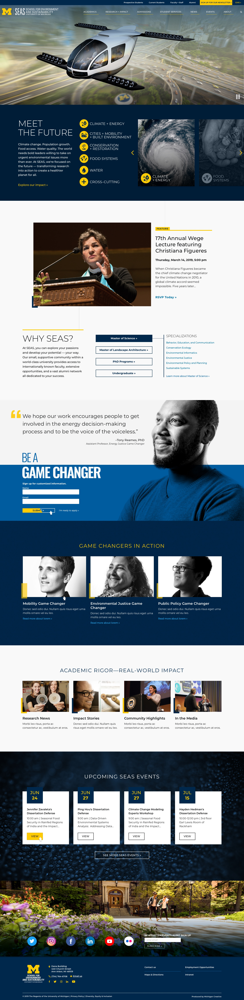
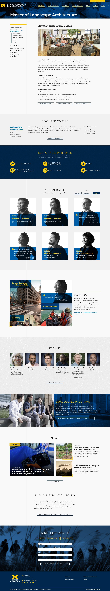

## Project duration

April 2019 - May 2020

## Role

Designer and contributed to the fit & finish for the front end of the site.

## Background

A complete redesign of U-M's School for Environment and Sustainability. Initial phases included interviews with faculty and students. Many iterations to get this just right. Our whole team is very proud of this project!

[Visit site](https://seas.umich.edu/)
