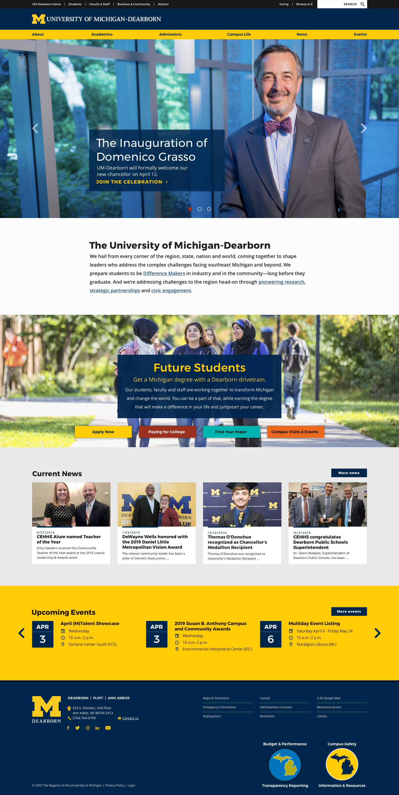
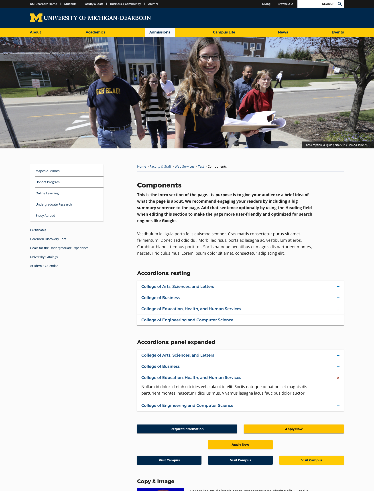

## Project duration

February 2019 - November 2019

## Role

Designer and developer of the style guide (HTML/CSS/JS prototypes of components). The style guide was built with VuePress, my first time using VueJS.

## Background

Rather than go through a full redesign process, UM-Dearborn opted to conduct a visual refresh of their existing components using the same markup. An upgrade to their typography really went a long way for them. The Dearborn team were truly partners in this. They are sharp and an absolute joy to work with.

[Visit site](https://umdearborn.edu/)